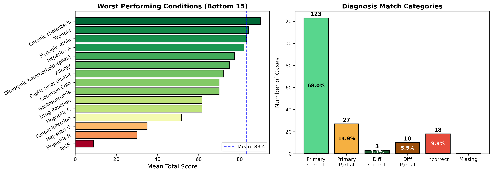
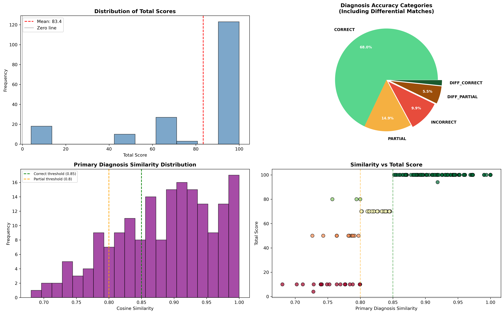
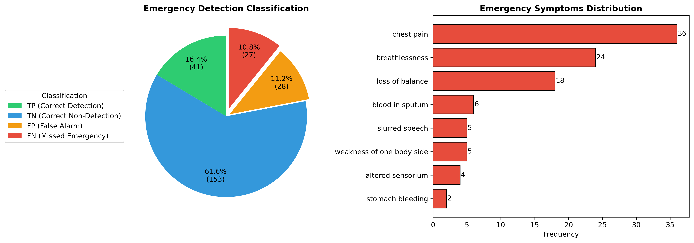

# Blackwell - AI Clinical Assistant

Blackwell is a Multi Agent Clinical Decision Support System that pragmatically investigate the Patient's (user) complaints via an Anamnesis procedure that rapidly ask all the necessary questions for proper screening and reporting.
After Anamnesis is complete, the multi-agent evaluator utilizes the capabilities of Retrieval-Augmented Generation (RAG) and Web Crawling Agents, to provide insightful hypothesis over the patient's complaints and history, which then is passed to a treatment-focused agent that investigates the state-of-the-art treatment's procedure, efficacy available at PubMed's large web database. This agentic system is built with LangChain and LangGraph, and it can be powered by local LLMs via Ollama or powerful models like Google's Gemini.

At its core, Blackwell has Medline complete database indexed into a ChromaDB vector store. The PubMed's agent goes deep through PubMed's vast library in search for treatment options, efficacy and guidelines.

The project also includes a user-friendly web interface for interacting with the agent where the patient can interact with the agent and receive a detailed report of the agent's finding and hypothesis, which then can be presented to Clinical Practitioner. The Application does not hold patient information and conversation to protect their personal data.

#### Key technologies used in this project include:

- LangChain & LangGraph: For building the core multi-agent pipeline.
- Google Gemini & Ollama: Providing the language models that power the agent.
- ChromaDB: For creating and managing the vector store.
- MCP (Model Context Protocol): To enable the generation of Word Documents.
- Flask: For the web application that serves the user interface.

### Getting API Keys

- Google Gemini API Key at https://aistudio.google.com/
- PubMed API Key at: https://account.ncbi.nlm.nih.gov/signup/
- LangSmith API Key at: https://eu.smith.langchain.com/

### Installing dependencies

- Run pip install .

### Indexing Medline Database

- Move the indexing.ipynb from evaluation/notebooks folder to the root directory.
- Run the notebook to create the ChromaDB vector store.

### Running

- Web UI: Start the web server and open the browser
  - uvicorn web_app:app --reload
  - Visit http://localhost:8000
  - The web interface provides:
    - A chat box to interact with the agent
    - A charming UI for presenting the reports

### Evaluation System

The project includes a comprehensive evaluation system with a special AI Patient to simulate patient's history based on the Prognosis Disease Symptoms Dataset available at (https://www.kaggle.com/datasets/noeyislearning/disease-prediction-based-on-symptoms)

#### Evaluation Results

The system was evaluated on **250 simulated patient cases** covering a diverse range of conditions. The evaluation uses **semantic similarity** (cosine distance with Gemini embeddings) to compare the AI's diagnosis against the ground truth.

##### Diagnosis Accuracy

| Category                                    | Count | Percentage |
| ------------------------------------------- | ----- | ---------- |
| **CORRECT** (Primary diagnosis, sim ≥ 0.85) | 123   | 68.0%      |
| **PARTIAL** (Primary diagnosis, sim ≥ 0.80) | 27    | 14.9%      |
| **DIFF_CORRECT** (Correct in differential)  | 3     | 1.7%       |
| **DIFF_PARTIAL** (Partial in differential)  | 10    | 5.5%       |
| **INCORRECT**                               | 18    | 9.9%       |

**Overall Accuracy Summary:**

- **Primary matches (CORRECT + PARTIAL): 82.9%**
- **Total correct (including differentials): 90.1%**

##### Scoring System

The evaluation uses a comprehensive scoring system (max 100 points):

| Component          | Points | Description                                                                |
| ------------------ | ------ | -------------------------------------------------------------------------- |
| Diagnosis Score    | 0-90   | Primary focus - semantic similarity with ground truth                      |
| Completeness Score | 0-4    | Presence of required sections (differential, exams, treatment, references) |
| Quality Score      | 0-6    | Patient-specific considerations and clinical quality                       |

**Score Statistics:**

- Mean Total Score: **83.4**
- Median Total Score: **100.0**
- Score Range: 0 to 100

##### Analysis Visualizations

  

  

#### Anamnesis (Medical History) Evaluation

The anamnesis agent was also evaluated for its ability to:

1. **Capture patient symptoms** - Using semantic similarity to verify symptom recall
2. **Detect emergencies** - Identifying critical symptoms requiring immediate attention

##### Emergency Detection Performance

The system monitors for critical symptoms including: chest pain, breathlessness, altered sensorium, stomach bleeding, blood in sputum, slurred speech, weakness of one body side, and loss of balance.

  

